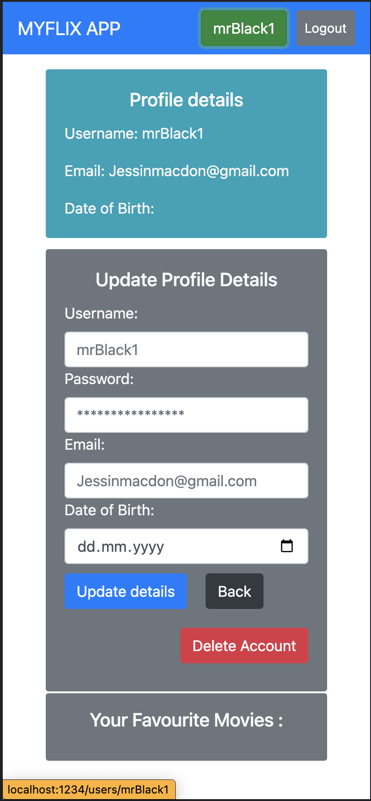
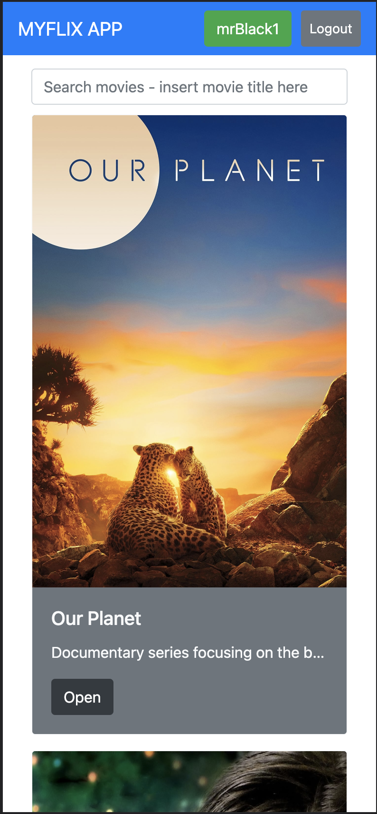
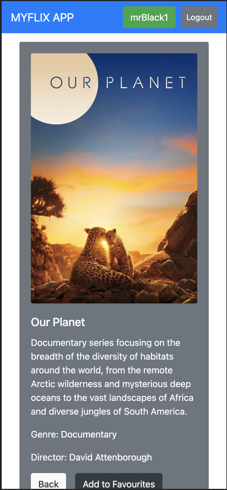
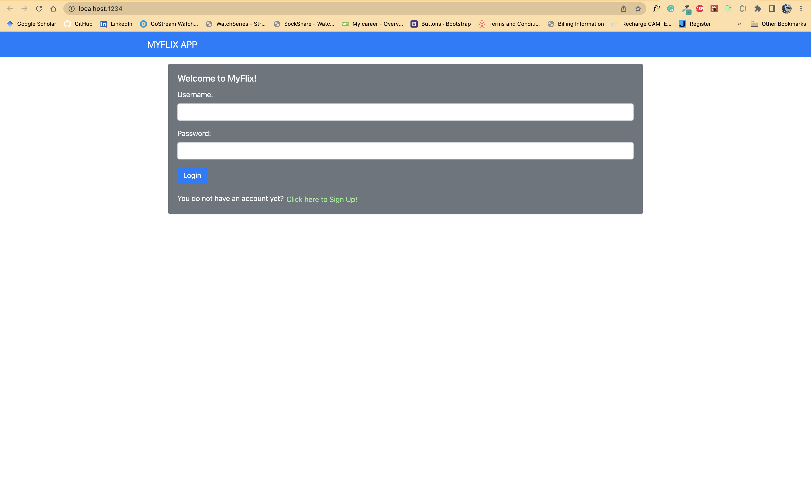
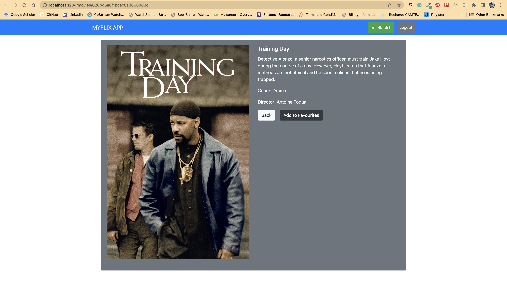

# myFlix Client

This is how it will look on mobile (tested on pixel5)
<p float="left">
  
   
   
</P>


## Description
This client the front-end of the myFlix application. It provide users with access to information about different movies, directors, actors and genres. Users will be able to sign up, update their personal information, and create a list of their favorite movies.

### What technology usage and why?
This app was built using HTML5, SCSS, and JavaScript ES6 languages.

Parcel
React
redux
React-Bootstrap

As a build tool I used Parcel, because it

- requires minimal configuration
- has fast bundle times
- is well-documented
- actively maintained
- works automatically with a variety of files
- offers some very useful features, such as building and serving code. 
- Parcel is very helpful, it refreshes the browser every time the code changes (support for React Fast Refresh)

**Further information on my environment:**

- Node 16.14.2
- parcel 2.4.1
- Chrome

---
## Key features

### Users should be able to :
retrieve information on movies, directors, actors and genres
create and update their user profile
create and edit a list of favourite movies
Returns a list of ALL movies to the user (each listed item with an image, title, and description)
Sorting and filtering
Ability to select a movie for more details
Single movie view

Returns data (description, genre, director, image) about a single movie to the user
Allows users to add a movie to their list of favorites

**Login view**

- Allows users to log in with a username and password

**Registration view**

- Allows new users to register (username, password, email, birthday)

**Genre view**

- Returns data about a genre, with a name and description
- Displays example movies

**Director view**

- Returns data about a director (name, bio, birth year, death year)
- Displays example movies

**Profile view**

- Allows users to update their user info (username, password, email, date of birth)
- Allows existing users to deregister
- Displays favorite movies
- Allows users to remove a movie from their list of favorites

**Single movie view and all movies views**

- Allow users to see which actors star in which movies
- Allow users to view more information about different movies, like the release date and the movie rating

---

### What challenges did I face, what did I learn?
***From the initialisation of the project (setting up the development environment)***

in 2021 React 18 introduced a new root API, namely ReactDOM.createRoot. It is no longer necessary to pass the container into the render. This means that one needs to replace render with createRoot. For more information, click here https://reactjs.org/blog/2022/03/08/react-18-upgrade-guide.html

*Project setup:* 
In the package.json the entry point may not be "main", because main is used as the output file of the build. Instead define the source code for the library as follows:

```
"source": "src/index.html"
```

Use index.html as entry point for build process: parcel src/index.html

*Parcel:*
The command parcel src/index.html threw an error, saying

```
@parcel/package-manager: Could not find module "@parcel/transformer-sass" satisfying 2.0.0-rc.0
```

the solution was to remove the @oarcel/transformer-sass:^2.4.1 from the package.json, deleting node-modules and package-lock.json file and then run npm install. As a result the version 2.0.0-rc.0 was installed and added as a dependencies.

- Parcel build process threw error, which was solved by adding type="module" to script tag in index.html
- add to package.json

```
"start": "parcel", // parcel watch + dev server
"watch": "parcel watch", // parcel build + automatic reload
"build": "parcel build"
```

- There is a new version of react-router-dom (6.3.0) which differs significantly from the version used by CF (v.5.3.0). I had to downgrade to the older version in order to be able to follow the directions provided by CF for routing between the views.

- React Redux has some pitfalls when loading data from an API (in this case, waiting for the user and movies state to be successfully set before setting the favorite movies state). Therefore, try using Redux toolkit (RTK) to fix this!

#### How to install and run the project ...
**If you want to work with the project**

1. Clone or download repository ...

```
https://github.com/jessinmacdon/myFlix-client.git
```

2. Run parcel to build

```
parcel src/index.html
```

---
### Technical Requirements (following the CF project brief)

- SPA application built using React
- Navigate between views using react-router-dom
- Use Parcel as build tool
- Use react-bootstrap for UI
- Use React Redux for state management (respecting the Flux pattern)
- Use both class and function components
- Use axios to connect to API (providing user and movie information)

---
## Development Process of the Client-Side for MyFlix Application

**Create React components for each view**

- Main View routes to all sub views using react-router-dom
- Create functional component for each sub view // distinct functionality in view
- Use bootstrap Card component to create Movie card for each movie

**Connect to database via axios**

- Get data on movies and users from API using axios library
- Use Redux for state management
- User & movie data is accessed and modified from different components 

### Use redux to manage state in one place (store)
Same for favorite movies
 Has to be loaded once both user and movie data states are successfully set

This App will be hosted on Netlity at a later point - updates to come.

--







